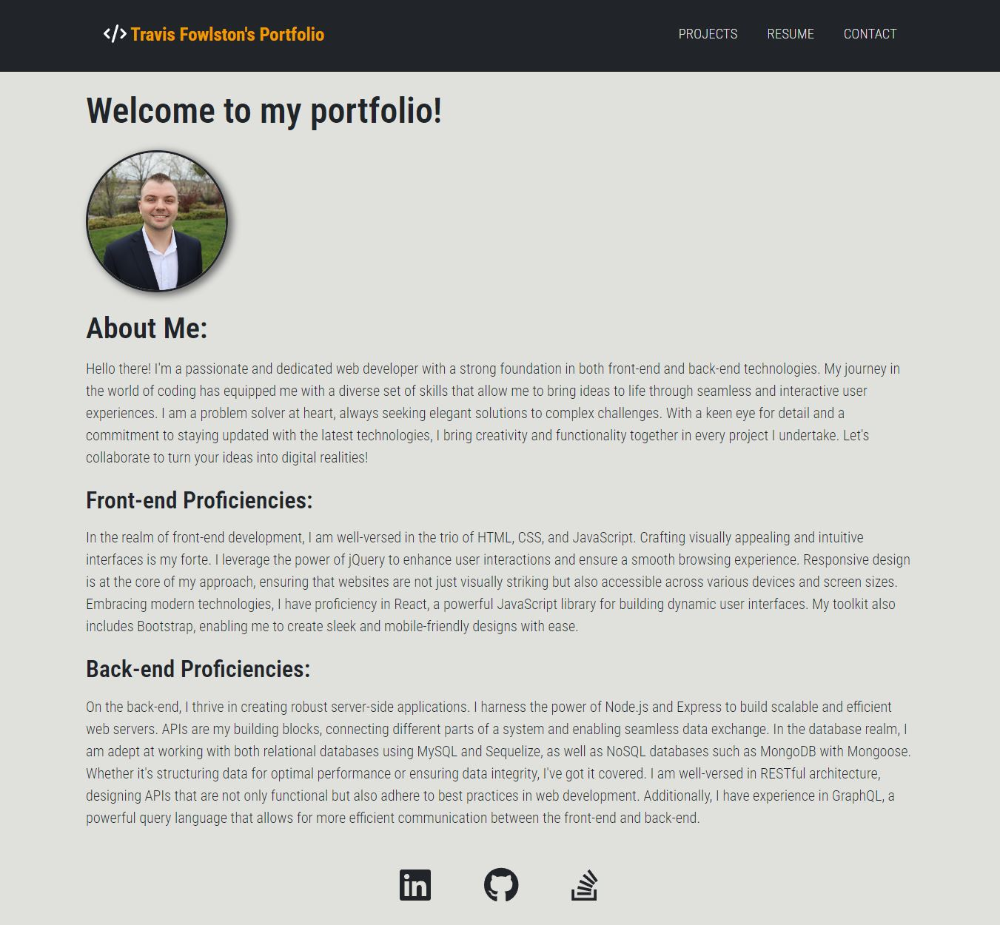

# Travis Fowlston's Portfolio

## Project Description

The Module 20 Challenge objective was to create a portfolio, using your new React skills to help set you apart from other developers whose portfolios don’t use the latest technologies.

## Deployment Screenshot

[Deployment Link]()

## Comments

- Application uses React to render content.
- Application uses mobile-first design.
- Application has a single Header component that appears on multiple pages, with a Navigation component within it that uses react-router-dom to render About Me, Portfolio, Contact, and Resume sections.
- Application has a single Project component that’s used multiple times in the Portfolio section.
- Application has a single Footer component that appears on multiple pages.

## Credits

- Project was completed by Travis Fowlston.
